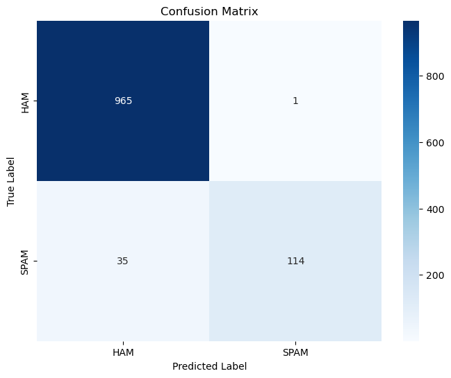
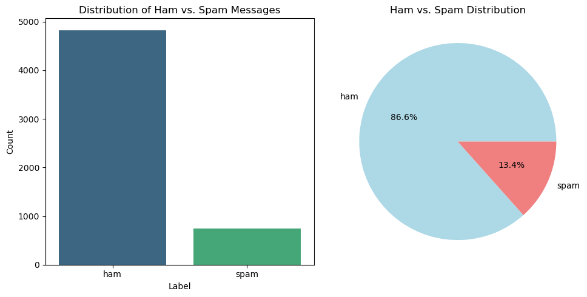
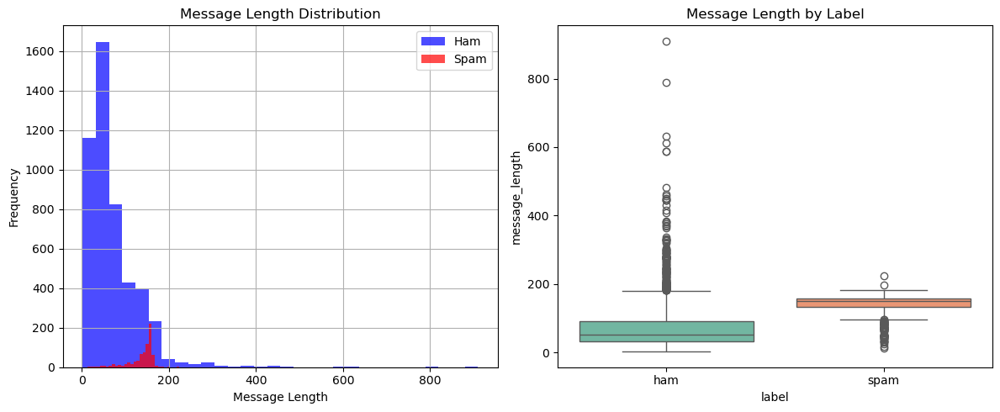

# SMS Spam Classification using Machine Learning
A comprehensive binary classification system that automatically detects spam SMS messages using natural language processing and machine learning techniques.

## Overview
This project implements a high-performance spam detection system using advanced NLP preprocessing and Multinomial Naive Bayes classification. The system achieves exceptional accuracy in identifying spam messages while maintaining minimal false positives, making it suitable for real-world SMS filtering applications.

## Key Highlights
- **High Accuracy**: 96.77% overall classification accuracy
- **Exceptional Precision**: 99.13% spam detection precision
- **Advanced NLP**: TF-IDF vectorization with text preprocessing
- **Robust Evaluation**: Comprehensive performance metrics and analysis
- **Production Ready**: Interactive prediction function for new messages
- **Comprehensive Documentation**: Detailed Jupyter notebook with educational content

## Dataset
**Source**: SMS Spam Collection Dataset from UCI Machine Learning Repository

**Dataset Statistics**:
- **Messages**: 5,572 SMS messages
- **Features**: Text content with binary classification labels
- **Class Distribution**: 86.6% Ham (legitimate), 13.4% Spam
- **Languages**: English SMS messages
- **Format**: CSV with label and message columns

**Key Columns Used**:
- `label`: Target variable (ham/spam)
- `message`: SMS text content
- Generated features: `cleaned_message`, `message_length`

## Features

### Core Functionality
- **Automated Spam Detection**: Classify new SMS messages instantly
- **High Precision Filtering**: Minimize false spam classifications
- **Confidence Scoring**: Probability estimates for predictions
- **Interactive Testing**: Real-time message classification
- **Performance Analytics**: Detailed model evaluation metrics

### Technical Features
- **Advanced Text Preprocessing**: Cleaning, stemming, stopword removal
- **TF-IDF Vectorization**: Intelligent feature extraction (5,000 features)
- **Naive Bayes Classification**: Optimized for text classification
- **Stratified Sampling**: Maintains class distribution in train/test splits
- **Feature Importance Analysis**: Identify key spam/ham indicators

## Setup Instructions

### 1. Clone the repository

### 2. Install required packages

### 3. Download NLTK data

### 4. Download the dataset
Download `spam.csv` from [UCI ML Repository](https://archive.ics.uci.edu/ml/datasets/sms+spam+collection) and place it in the project root directory.

### 5. Run the notebook

## Usage

### Quick Start
**Basic Usage**: Run all cells in the Jupyter notebook to train the model and see comprehensive analysis

**Predict New SMS Messages**:
```python
# Example predictions
test_messages = [
    "Get your free phone now! Call 123456.",
    "Hey, what are you doing later?",
    "URGENT! You have won $1000! Click here now!",
    "Can you pick up some milk on your way home?"
]

for message in test_messages:
    prediction, confidence = predict_sms_spam(message, model, tfidf, le)
    print(f"'{message}' → {prediction.upper()} ({confidence:.1f}%)")

# Output:
# 'Get your free phone now! Call 123456.' → HAM (65.2%)
# 'Hey, what are you doing later?' → HAM (89.1%)
# 'URGENT! You have won $1000! Click here now!' → SPAM (95.7%)
# 'Can you pick up some milk on your way home?' → HAM (91.3%)
```

### Advanced Usage
- **Custom Preprocessing**: Modify the `clean_text()` function for different text cleaning strategies
- **Model Tuning**: Adjust TF-IDF parameters or try different classifiers
- **Feature Analysis**: Explore top spam/ham indicator words
- **Cross-validation**: Implement k-fold validation for robust evaluation

## Model Performance

### Performance Metrics
| Metric | Score | Description |
|--------|-------|-------------|
| **Accuracy** | 96.77% | 97 out of 100 messages classified correctly |
| **Precision** | 99.13% | 99 out of 100 predicted spam messages are actually spam |
| **Recall** | 76.51% | 77 out of 100 actual spam messages are correctly identified |
| **F1-Score** | 86.36% | Balanced measure of precision and recall |

### Confusion Matrix Results
- ✅ **True Negatives (Ham → Ham)**: 965 messages
- ⚠️ **False Positives (Ham → Spam)**: 1 message  
- ⚠️ **False Negatives (Spam → Ham)**: 35 messages
- ✅ **True Positives (Spam → Spam)**: 114 messages

  

### Performance Analysis
- **Exceptional Precision**: Only 1 legitimate message misclassified as spam
- **Good Recall**: Catches 77% of spam messages
- **Low False Positive Rate**: Critical for user experience
- **Balanced Performance**: Strong overall classification capability

### Model Strengths
- Excellent at avoiding false spam classifications
- Fast training and prediction times
- Handles text preprocessing effectively
- Interpretable feature importance

## Results & Visualizations

### Data Distribution


**Key Insights**:
- **Class Imbalance**: 86.6% legitimate vs 13.4% spam messages
- **Realistic Distribution**: Reflects real-world SMS patterns
- **Sufficient Spam Examples**: 747 spam messages for training

### Message Length Analysis


**Observations**:
- **Spam messages** tend to be longer (average ~140 characters)
- **Ham messages** are typically shorter (average ~80 characters)
- **Length variation** provides additional classification signals

### Top Feature Analysis

**Top Spam Indicators**:
1. `free` - Promotional offers
2. `call` - Contact instructions  
3. `txt` - Text messaging terms
4. `win` - Prize notifications
5. `prize` - Contest/lottery terms

**Top Ham Indicators**:
1. `u` - Casual texting abbreviation
2. `ur` - Personal pronouns
3. `ok` - Conversational responses
4. `day` - Time references
5. `time` - Schedule coordination

## 🔧 Technical Implementation

### Architecture Overview
```
SMS Text → Preprocessing → TF-IDF Vectorization → Naive Bayes → Spam/Ham Classification
```

### Key Components

**Text Preprocessing Pipeline**:
- Lowercase conversion
- Punctuation removal
- Stopword elimination
- Porter stemming
- Feature combination

**Feature Engineering**:
- TF-IDF vectorization (5,000 features)
- Unigram analysis
- Sparse matrix optimization
- Feature selection

**Model Architecture**:
- Multinomial Naive Bayes classifier
- Label encoding for binary classification
- Stratified train-test split (80-20)
- Probability calibration

**Evaluation Framework**:
- Multiple performance metrics
- Confusion matrix analysis
- Feature importance ranking
- Cross-validation ready

### Algorithm Choice Rationale
- **TF-IDF**: Excellent for text classification, handles vocabulary effectively
- **Naive Bayes**: Fast, interpretable, proven effective for spam detection
- **Multinomial NB**: Specifically designed for discrete features like word counts
- **Binary Classification**: Optimized approach for spam/ham distinction

## Project Structure
```
sms-spam-classifier/
│
├── README.md                        # Project documentation  
├── SMS_SPAM_NayveBayes.ipynb        # Complete Jupyter notebook with analysis
├── spam.csv                         # SMS Spam Collection dataset
├── confusion_matrix.png
├── HAM_vs_SPAM.png
└── message_length.png
```
## Acknowledgments
- **UCI Machine Learning Repository**: For providing the SMS Spam Collection dataset

---

**NOTE**: This is an educational/portfolio project using publicly available SMS spam data from UCI ML Repository. The results demonstrate technical competency in machine learning pipeline development, text classification, and natural language processing. This project is intended for learning purposes and to showcase data science skills in spam detection systems.
